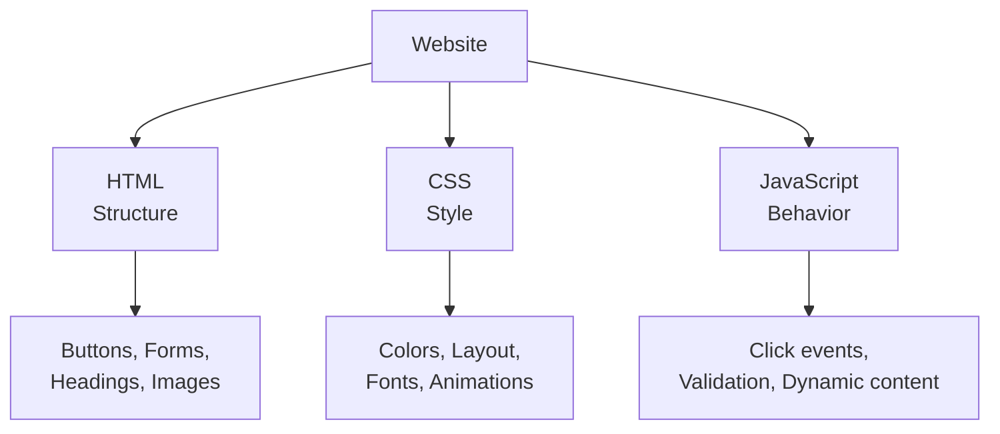

# What is JavaScript?

## 1. Programming Language

JavaScript is a **high-level, interpreted** programming language.

- **High-level** → You write code using English-like words. You don’t need to manage memory, CPU registers, or hardware instructions manually.
- **Interpreted** → The code is executed line by line by a JavaScript engine (in the browser or Node.js). It is **not** compiled into machine code beforehand like C, C++, or Java.

This makes JavaScript easier and faster to learn and test compared to compiled languages.

---

## 2. Brief History

- Created in **1995** by **Brendan Eich** at Netscape in just **10 days**.
- Originally named **Mocha** → then **LiveScript** → finally renamed **JavaScript**.
- The name “JavaScript” was a marketing decision to benefit from the popularity of Java at that time.
- **Important**: JavaScript and Java are **completely different** languages (different design, different use cases, different companies).

---

## 3. JavaScript ≠ Java

| Point              | JavaScript                              | Java                              |
|--------------------|-----------------------------------------|-----------------------------------|
| Type               | Interpreted scripting language          | Compiled language                 |
| Runs on            | Browser + Node.js                       | JVM (Java Virtual Machine)        |
| Typing             | Dynamic                                 | Static                            |
| Created by         | Brendan Eich (Netscape)                 | James Gosling (Sun Microsystems)  |
| Main Use           | Web, mobile apps, servers, desktop      | Enterprise apps, Android, backend |
| File Extension     | `.js`                                   | `.java`                           |

**Key takeaway**: Just because the names look similar does **not** mean they are related.

---

## 4. Scripting Language for the Web

JavaScript was originally created to make web pages **dynamic and interactive**.

### Without JavaScript:
A website is mostly **static** — only text, images, and links. Nothing changes after the page loads.

### With JavaScript:
A website can become alive:
- Show pop-ups / alerts
- Change content when a button is clicked
- Validate forms before submitting
- Create animations, image sliders, games
- Update data without refreshing the page (AJAX / Fetch)

### Real-world Examples:
- **Google Maps** → Zoom, drag, search locations
- **YouTube** → Play/pause, like, comment, auto-play next video
- **Facebook / Instagram** → Like, comment, live chat, infinite scroll
- **Amazon** → Add to cart, filter products, live price updates

```html
<button onclick="alert('Hello Vikas!')">Click Me</button>
```

When the button is clicked, JavaScript runs and shows an alert.

---

## 5. The Three Pillars of Web Development

Modern websites are built using three core technologies:

| Technology     | Role                        | Analogy                  |
|----------------|-----------------------------|--------------------------|
| **HTML**       | Structure                   | Skeleton of a body       |
| **CSS**        | Presentation / Style        | Skin, clothes, makeup    |
| **JavaScript** | Behavior / Interactivity    | Brain + muscles          |

### Real-life Examples to Distinguish Them

#### Example 1: A Button
- **HTML** → Creates the button (`<button>Buy Now</button>`)
- **CSS** → Makes it look beautiful (color, size, hover effect, rounded corners)
- **JavaScript** → Makes it work (when clicked → add product to cart)

#### Example 2: A Login Form
- **HTML** → Creates input fields and the “Login” button
- **CSS** → Styles the form (centering, colors, shadows)
- **JavaScript** → Checks if email/password is empty or invalid **before** sending data to the server

#### Example 3: An Image Gallery
- **HTML** → Places the images on the page
- **CSS** → Arranges them in a grid / adds transitions
- **JavaScript** → Makes the “Next” and “Previous” buttons change the image

### Visual Representation

```
┌─────────────────────────────────────────────┐
│                 WEBSITE                      │
│                                              │
│   ┌────────────┐  ┌────────────┐  ┌────────┐ │
│   │    HTML    │  │    CSS     │  │   JS   │ │
│   │ Structure  │  │   Style    │  │Behavior│ │
│   │ (Skeleton) │  │  (Look)    │  │ (Brain)│ │
│   └────────────┘  └────────────┘  └────────┘ │
└─────────────────────────────────────────────┘
```

**Mermaid Diagram** (works in GitHub, VS Code, Obsidian, Notion, etc.):



---

## 6. Runs in the Browser

Every modern web browser has a **JavaScript Engine** that reads and executes JavaScript code.

| Browser     | JavaScript Engine      |
|-------------|------------------------|
| Chrome      | V8                     |
| Firefox     | SpiderMonkey           |
| Safari      | JavaScriptCore (Nitro) |
| Edge        | V8                     |

This is why JavaScript can run directly in the browser without installing anything extra.

---

## 7. Features of JavaScript

### 1. Dynamic Typing

You do **not** need to declare the type of a variable.

```javascript
let x = 10;           // Number
console.log(typeof x); // "number"

x = "Hello";          // Now it becomes String
console.log(typeof x); // "string"

x = true;             // Now Boolean
console.log(typeof x); // "boolean"
```

**Advantage**: Fast and flexible development  
**Disadvantage**: Easier to make type-related bugs if you’re not careful

### 2. Event-driven

JavaScript can wait for and respond to **events** (user actions).

Common events:
- `click`
- `keydown` / `keyup`
- `mouseover`
- `submit`
- `load`

This is what makes websites interactive.

### 3. Cross-platform

Write once, run almost everywhere:
- All major browsers
- Windows, macOS, Linux
- Mobile phones & tablets
- Servers (using Node.js)

---

## 8. Client-side vs Server-side JavaScript

### Client-side (Frontend)
- Code runs **in the user’s browser**
- Responsible for what the user sees and interacts with
- Examples: React, Vue, Angular, plain JavaScript

### Server-side (Backend)
- Code runs **on a remote server**
- Responsible for databases, authentication, business logic, APIs
- Examples: Node.js + Express, NestJS

### Request – Response Cycle (Very Important)

```
┌────────────┐         1. Request          ┌────────────┐
│            │ ──────────────────────────► │            │
│   Browser  │                             │   Server   │
│ (Client)   │ ◄────────────────────────── │ (Backend)  │
│            │         2. Response         │            │
└────────────┘                             └────────────┘
```

**Step-by-step example (Login):**

1. User enters email & password and clicks **Login** (Client-side JS validates the form).
2. Browser sends a **Request** to the server (`POST /login`).
3. Server (Node.js) checks the database.
4. Server sends back a **Response** (Success → redirect to dashboard, or Error → “Invalid password”).
5. Client-side JavaScript shows the result to the user.


---

## 9. Multipurpose Language

JavaScript is no longer “just for websites”:

| Area              | Technology              | Real Examples              |
|-------------------|-------------------------|----------------------------|
| Frontend          | React, Vue, Angular     | Facebook, Netflix, Airbnb  |
| Backend           | Node.js, Express        | PayPal, LinkedIn, Uber     |
| Mobile Apps       | React Native            | Instagram, Discord         |
| Desktop Apps      | Electron                | VS Code, Slack, Figma      |
| Games             | Phaser, Three.js        | Browser-based games        |
| AI / ML           | TensorFlow.js           | Running ML models in browser |

---

## 10. JavaScript Versions (ECMAScript)

**ECMAScript (ES)** is the official standard that JavaScript follows.

| Version       | Year   | Important Features                              |
|---------------|--------|-------------------------------------------------|
| ES5           | 2009   | Strict mode, JSON, forEach, map, filter         |
| ES6 / ES2015  | 2015   | `let`, `const`, Arrow functions, Classes, Modules, Template Literals |
| ES7 onwards   | 2016+  | `async/await`, Optional chaining (`?.`), Nullish coalescing (`??`) |

**We will use modern JavaScript (ES6+) throughout this course.**

---

## 11. How to Run JavaScript?

### A. Browser Console (Fastest for learning)

1. Open Chrome
2. Press `F12` or `Ctrl + Shift + J`
3. Go to **Console** tab
4. Type:

```javascript
console.log("Hello JavaScript!");
```

### B. Inline in HTML

```html
<!DOCTYPE html>
<html>
<head>
  <title>My First JS</title>
</head>
<body>
  <h1>Welcome</h1>
  <script>
    alert("Hello from JavaScript!");
  </script>
</body>
</html>
```

### C. External JavaScript File (Best Practice)

**script.js**
```javascript
console.log("Hello from external file");
alert("This is external JavaScript");
```

**index.html**
```html
<!DOCTYPE html>
<html>
<head>
  <title>External JS</title>
</head>
<body>
  <h1>External JavaScript Example</h1>
  <script src="script.js"></script>
</body>
</html>
```

**Benefits of external files:**
- Cleaner HTML
- Reusable across multiple pages
- Easier to maintain
- Browser can cache the file

---

## 12. Why Learn JavaScript?

- Only language that runs natively in every browser
- Extremely versatile (Frontend + Backend + Mobile + Desktop)
- Massive job market and community
- You can see results very quickly
- Foundation for modern frameworks (React, Next.js, Node.js, etc.)

---

## 13. Optional Light but Useful Points

### Case Sensitivity
JavaScript is **case-sensitive**.

```javascript
let name = "Vikas";
console.log(Name);   // Error! Name is not defined
```

### Comments
Comments are ignored by the JavaScript engine.

```javascript
// This is a single-line comment

/* This is a 
   multi-line comment */
```

---
